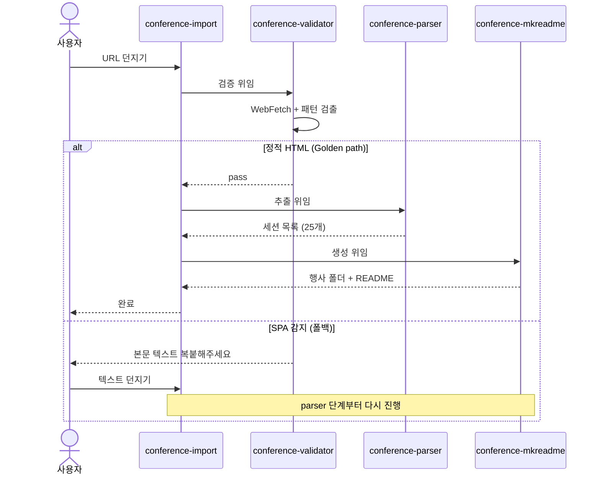
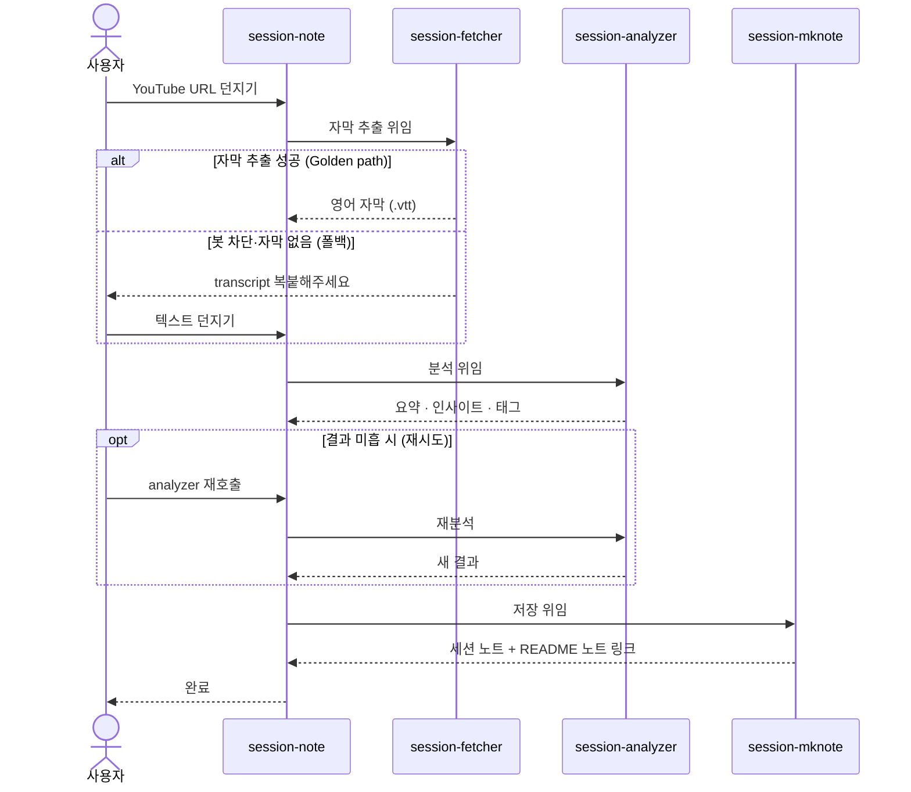
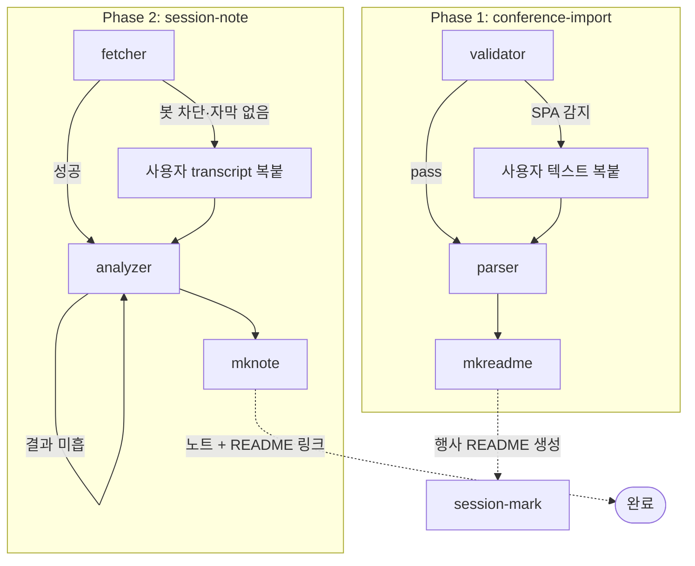

# 컨퍼런스 학습 추적 OS — End-to-end 사용 시나리오

이 문서는 OS 를 처음부터 끝까지 가동하는 흐름을 박제한다. 예시 행사로 **AWS Summit Seoul 2026** 을 사용한다.

> 본 문서는 OS 설계(`README.md`)와 짝을 이룬다. README 는 "무엇을 만들지", 이 문서는 "실제로 어떻게 흘러갈지" 를 다룬다.

---

## 전체 여정 한눈에

```
┌────────────────────────────────────────────────────┐
│ 0단계 · 행사 직후                                 │
│   URL 손에 들고 시작                              │
└────────────────────────────────────────────────────┘
                       │
                       ▼
┌────────────────────────────────────────────────────┐
│ 1단계 · /conference-import                        │
│   validator → parser → mkreadme                   │
│   → 행사 폴더 + README (모든 세션 "미정")         │
└────────────────────────────────────────────────────┘
                       │
                       ▼
┌────────────────────────────────────────────────────┐
│ 2단계 · /session-mark                             │
│   들음 / 관심 / 스킵 마킹 (나머지 자동 미정)      │
│   → README 카운트 갱신                            │
└────────────────────────────────────────────────────┘
                       │
                       ▼
┌────────────────────────────────────────────────────┐
│ 3단계 · 조회 (필요 시)                            │
│   /conference-status, /conference,                │
│   /session-preview, /find-session                 │
└────────────────────────────────────────────────────┘
                       │
                       ▼
┌────────────────────────────────────────────────────┐
│ 4단계 · /session-note (YouTube URL)               │
│   fetcher → analyzer → mknote                     │
│   → 세션 노트 + README 의 노트 링크 갱신          │
└────────────────────────────────────────────────────┘
                       │
                       ▼ (반복)
┌────────────────────────────────────────────────────┐
│ 5단계 · 학습 진행 — 4단계 반복                   │
└────────────────────────────────────────────────────┘
                       │
                       ▼
                 ┌──────────┐
                 │   종료   │
                 │ 만족 도달 │
                 └──────────┘
```

---

## 0단계 · 행사 직후 — OS 가동 준비

**상황**
- AWS Summit Seoul 2026 참가 후 며칠 지남
- 행사장에서 들은 세션도 있고, 시간 충돌로 못 들은 세션도 많음
- YouTube 에 세션 영상이 하나둘 올라오기 시작

**사용자 손에 있는 것**
- 컨퍼런스 세션 페이지 URL 1개

**OS 동작**
- 없음. 다음 단계에서 시작

---

## 1단계 · 행사 등록 (`/conference-import`)

**사용자**
```
/conference-import https://...aws-summit-seoul-2026/sessions
```

**OS 흐름 (sub-agent 3개 순차 위임)**

1. `conference-validator` — 페이지를 WebFetch 한 뒤 정적 HTML 패턴 검출 (시간 · 세션 제목 · 발표자)
   - **Golden path**: 패턴 3세트 이상 → pass
   - **폴백**: SPA 추정 → "행사 페이지 본문을 복붙해주세요" 안내 후 종료. 사용자가 텍스트를 던지면 다시 진입
2. `conference-parser` — HTML/텍스트 → 세션 목록 구조화 (예: 25개 세션)
3. `conference-mkreadme` — 행사 폴더 + README 생성 (모든 세션 "미정" 상태)

**시퀀스**



**산출물**
```
artifacts/conferences/aws-summit-seoul-2026/
└─ README.md   (25개 세션 행 + 카운트 "들음 0 / 관심 0 / 미정 25 / 스킵 0")
```

**완료 조건**
행사 README 가 모든 세션 메타데이터 + 분류 칸을 갖춘 상태로 생성됨.

---

## 2단계 · 분류 마킹 (`/session-mark`)

**사용자** — 행사 README 를 훑으며 마킹

```
/session-mark aws-summit-seoul-2026 S1 들음
/session-mark aws-summit-seoul-2026 S15 관심
/session-mark aws-summit-seoul-2026 S22 관심
/session-mark aws-summit-seoul-2026 S30 스킵
...
```

**OS 흐름** — 각 호출마다 README 의 해당 세션 행 상태와 진척 카운트 동시 갱신

**핵심 원칙**
사용자는 "들음 / 관심 / 스킵" 만 명시적으로 마킹. 나머지는 자동 "미정" 으로 남음. 50~100 세션이어도 분류 노동이 폭발하지 않음.

**완료 조건**
사용자가 마킹하고 싶은 세션을 다 마킹. (강제 종료 시점 없음 — 학습 진행하며 추가 마킹 가능)

---

## 3단계 · 진척·세션 정보 점검 (조회 스킬)

세션 수가 많아 한눈에 안 들어올 때 자유롭게 호출.

```
/conference-status aws-summit-seoul-2026
→ "들음 5 / 관심 8 / 미정 12 / 스킵 0 (총 25)"

/conference aws-summit-seoul-2026
→ 25개 세션 이름 + 각 세션 상태 표

/session-preview aws-summit-seoul-2026 S15
→ 세션 메타데이터 + 상태 + 노트 TL;DR (아직 노트 없으면 "노트 없음")

/find-session aws-summit-seoul-2026 Bedrock Kiro
→ 제목에 "Bedrock" 또는 "Kiro" 포함된 세션만 표로 필터
```

이 단계는 필요할 때 호출. Golden path 의 필수 단계는 아님.

---

## 4단계 · 세션 노트 생성 (`/session-note`)

**사용자** — 관심 세션의 YouTube 영상이 공개되면

```
/session-note https://www.youtube.com/watch?v=...
```

**OS 흐름 (sub-agent 3개 순차 위임)**

1. `session-fetcher` — `yt-dlp` 로 영어 자동 자막(`.vtt`) 다운로드
   - **Golden path**: 자막 추출 성공
   - **폴백**: 봇 차단·자막 없음 → "YouTube 의 transcript 영역을 복붙해주세요" 안내. 사용자가 텍스트를 던지면 다음 단계로 진입
2. `session-analyzer` — 영어 자막 → 한국어 분석·요약
   - 출력: **TL;DR** (1~3줄) / **핵심 인사이트** (불릿 3~7개) / **태그**
   - **재시도 가능**: 인사이트가 일반론으로 흐르거나 발표자 관점이 안 살면 analyzer 만 다시 호출
3. `session-mknote` — 세션 노트 markdown 작성 + 행사 README 의 해당 행 "노트" 컬럼에 링크 추가

**시퀀스**



**산출물**
```
artifacts/conferences/aws-summit-seoul-2026/
├─ README.md   (bedrock-deep-dive 행의 "노트" 컬럼에 sessions/bedrock-deep-dive.md 링크)
└─ sessions/
   └─ bedrock-deep-dive.md   (frontmatter + TL;DR + 핵심 인사이트 + 태그)
```

**완료 조건**
세션 노트 markdown 1개 생성 + 행사 README 의 행에 노트 링크 반영.

---

## 5단계 · 학습 진행 (반복)

관심 세션을 하나씩 골라 4단계 반복. 진척 추적은 3단계 조회 스킬로 확인.

**자연 종료 시점**
- 관심 세션 모두 노트화 완료
- 또는 사용자가 "이 정도면 됐다" 라고 판단

흐지부지를 막는 핵심은 **"다음에 무엇을 들어야 하는지" 를 OS 가 README 와 카운트로 가시화** 하는 것. 진척이 보이는 한 흐지부지는 막힌다.

---

## 폴백 시나리오 요약

| 단계 | 폴백 트리거 | 사용자 행동 | 재진입 |
|---|---|---|---|
| 1단계 검증 | 컨퍼런스 페이지가 SPA | 페이지 본문 텍스트 복붙 | parser 단계부터 다시 진행 |
| 4단계 자막 추출 | yt-dlp 봇 차단·자막 없음 | YouTube transcript 영역 복붙 | analyzer 단계부터 다시 진행 |
| 4단계 분석 미흡 | 인사이트가 일반론으로 흐름 | analyzer 만 재호출 | mknote 가 결과로 노트 덮어쓰기 |

**분기 흐름**



---

## OS 가 "끝났다" 고 보는 시점

OS 는 사용자 학습에 끝이 있다고 가정하지 않는다. 다만 각 단계마다 명확한 종료 조건이 있다:

| 종료 조건 | 의미 |
|---|---|
| **Phase 1 종료** | 행사 README 가 모든 세션 + 분류로 채워짐 |
| **Phase 2 한 사이클 종료** | 세션 1개당 노트 1개 + README 링크 반영 |
| **사용자 만족 종료** | 진척 카운트를 보고 "이만하면 됐다" 라고 판단 |

---

## 한 줄 요약

URL 한 줄 → 행사 README → 분류 마킹 → 관심 세션 골라 학습 노트 → 진척 가시화. 흐지부지를 막는 게 끝이지 OS 가 학습을 종결시키지 않는다.
